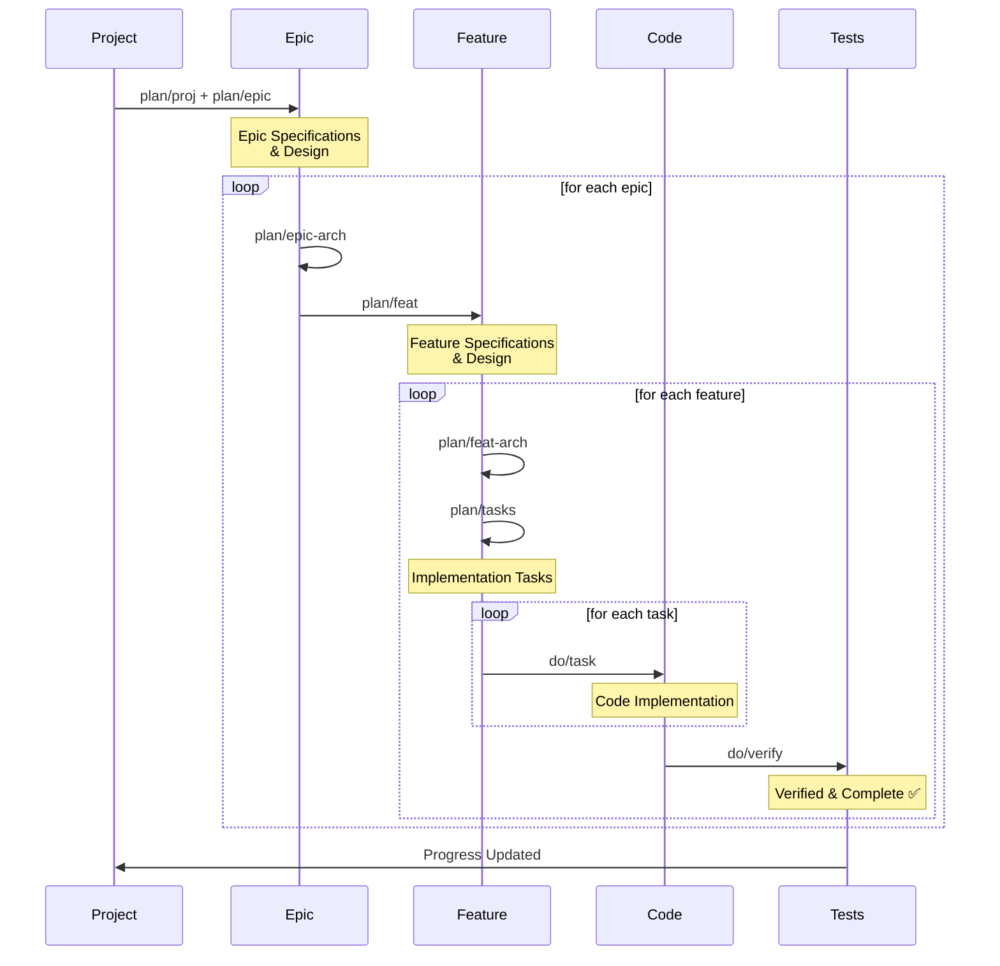

# plan-doc-do-follow Skill

A comprehensive product development workflow: **Plan** your product → **Doc**ument specifications → **Do** the work → **Follow** up with verification.

Structured planning with built-in business reviews, single-source-of-truth status tracking, and clear routing from product vision to shipped features.

Good for keeping a good and consistent project documentation and also for a structured way of AI coding.

## Installation

### Cursor (project skill)

Clone into your repository:

```bash
git submodule add git@github.com:codeAvecCyril/ia-skill-plan-doc-do-follow.git .claude/skills/plan-doc-do-follow
```

Add a thin wrapper so Cursor auto-discovers the skill:

```bash
mkdir -p .cursor/skills/plan-doc-do-follow
```

Create `.cursor/skills/plan-doc-do-follow/SKILL.md` pointing to `.claude/skills/plan-doc-do-follow/SKILL.md`.

### Cursor (personal skill)

```bash
git clone git@github.com:codeAvecCyril/ia-skill-plan-doc-do-follow.git ~/.cursor/skills/plan-doc-do-follow
```

### Claude Code (project skill)

```bash
git submodule add git@github.com:codeAvecCyril/ia-skill-plan-doc-do-follow.git .claude/skills/plan-doc-do-follow
```

### Project prerequisites

This skill expects a repository with:

- `docs/product.md` — product vision
- `docs/global_architecture.md` — system architecture
- `docs/technical-stack.md` — technology decisions
- `.github/instructions/` — coding standards (optional)
- `.github/copilot-instructions.md` — repository conventions (optional)

## 🎯 The Workflow



## 🚀 Quick Start

### Try It Now
```
"Use plan/proj to extract major epics from our product vision"
"Use plan/feat to define the user authentication feature"
"Use plan/tasks to break authentication into tasks"
"Use do/task to implement the first task"
"Use do/verify to check if it's complete"
```

### 13 Routes, 2 Phases

**Plan Phase** (Create specs & validations):
- `plan/proj` - Extract epics from product
- `plan/proj-review` - Validate epics
- `plan/epic` - Create epic PRD
- `plan/epic-review` - Validate epic
- `plan/epic-arch` - Design epic architecture
- `plan/feat` - Create feature PRD
- `plan/feat-review` - Validate feature
- `plan/feat-arch` - Design feature architecture
- `plan/tasks` - Break into tasks

**Do Phase** (Execute & verify):
- `do/task` - Implement a task
- `do/all-tasks` - Implement all feature tasks
- `do/verify` - Verify completion
- `do/memorize` - Document patterns and best practices

## 📂 Templates Included

The skill includes ready-to-use templates:

**Project Level**:
- `template-proj-status.md` - Project status and epic roadmap
- `template-proj-review.md` - Project review checklist

**Epic Level**:
- `template-epic-brief.md` - Epic brief summary
- `template-epic-prd.md` - Epic PRD structure
- `template-epic-review.md` - Epic review checklist
- `template-epic-arch.md` - Epic architecture design
- `template-epic-status.md` - Epic status tracking

**Feature Level**:
- `template-feat-prd.md` - Feature PRD structure
- `template-feat-review.md` - Feature review checklist
- `template-feat-arch.md` - Feature architecture design
- `template-feat-tasks.md` - Task breakdown
- `template-feat-status.md` - Feature status tracking

## 🎯 How It Works

1. **Extract** what you're building with `plan/proj`
2. **Design** the epic with `plan/epic` + `plan/epic-arch`
3. **Define** features with `plan/feat` + `plan/feat-arch`
4. **Break down** into tasks with `plan/tasks`
5. **Implement** with `do/task`
6. **Verify** with `do/verify`

Each route creates clear deliverables and tracks progress automatically.

## 📊 Output Files

Routes create organized documentation:

```
docs/
├── project-status.md              ← from plan/proj
├── project-review.md              ← from plan/proj-review
├── patterns/                      ← from do/memorize
│   └── {pattern-name}.md          (e.g., python-environment-management.md)
└── epics/e{n}-{epic-name}/        (e.g., e2-orm-discovery)
    ├── epic-brief.md              ← from plan/proj
    ├── epic-prd.md                ← from plan/epic
    ├── epic-status.md             ← from plan/epic
    ├── epic-arch.md               ← from plan/epic-arch
    ├── epic-review.md             ← from plan/epic-review
    └── features/f{n}-{feat-name}/ (e.g., f3-backend-api)
        ├── feat-prd.md            ← from plan/feat
        ├── feat-status.md         ← from plan/feat
        ├── feat-arch.md           ← from plan/feat-arch
        ├── feat-tasks.md          ← from plan/tasks
        └── feat-review.md         ← from plan/feat-review
```

## ✨ Key Features

✅ **13 Focused Routes** - Each does one thing well
✅ **Short Names** - Easy to remember and type (plan/proj, do/task, etc.)
✅ **Single Source of Truth** - Status tracked in one file per level
✅ **Progressive Detail** - Information gets more detailed as you go
✅ **Built-in Reviews** - Business validation at each stage
✅ **Auto Progress** - Task completion automatically updates epic/project %
✅ **Clear Templates** - Ready-to-use formats for all documents
✅ **Technical Integration** - References technical-stack.md and coding standards
✅ **Flexible Usage** - Use routes sequentially or jump as needed
✅ **Professional** - Production-grade workflow

## 💡 Typical Usage

**New project planning:**
```
plan/proj → plan/epic → plan/epic-arch → plan/feat → plan/feat-arch → plan/tasks
```

**Existing project, new feature:**
```
plan/feat → plan/feat-arch → plan/tasks → do/task → do/verify
```

**Bulk feature implementation:**
```
plan/tasks → do/all-tasks → do/verify (if all tasks can run in parallel)
```

**Code-first work:**
```
do/task → do/verify (if tasks already exist)
```

## 🔗 Integration

This skill references:
- `docs/product.md` - Product vision
- `docs/global_architecture.md` - System architecture
- `docs/technical-stack.md` - Technology decisions
- `docs/patterns/` - Documented best practices (created by do/memorize)
- `.github/instructions/` - Coding standards
- `.github/copilot-instructions.md` - Repository conventions

## 📝 Status Tracking

Work progresses through clear statuses (with emoji indicators):

| Status | Emoji | Meaning                   |
| ------ | ----- | ------------------------- |
| TODO   | ⚪   | Not started                |
| SPEC   | 🟡   | Business spec reviewed     |
| PLAN   | 🟣   | Tasks generated            |
| DEV    | 🔵   | Implementation in progress |
| DONE   | 🟢   | Verified complete          |

Progress is calculated automatically:
```
Feature % = Completed Tasks / Total Tasks
Epic % = Sum(Completed Tasks in All Features) / Sum(Total Tasks in All Features)
Project % = Sum(Completed Tasks in All Epics) / Sum(Total Tasks in All Epics)
```

## 🤔 Common Questions

**Q: Can I skip routes?**
A: Yes. *-review routes can be skipped, and you can jump between phases.

**Q: How do I reference technical decisions?**
A: Routes mention `docs/technical-stack.md` - use it for architecture and feature-design routes.

**Q: What team size is this designed for?**
A: Works for teams of 1-50+ developers. Self-adjusts to team velocity.

**Q: Can multiple features be planned in parallel?**
A: Absolutely. One team can be in `plan/feat` while another is in `do/task`.

---

**Version**: 2.0 (Optimized for brevity and usability)
**Status**: Production Ready
**Last Updated**: June 2026
**License**: Apache-2.0 — see [LICENSE](LICENSE)

**The philosophy**: Plan well, document clearly, execute focused, follow up consistently. Build great products.
