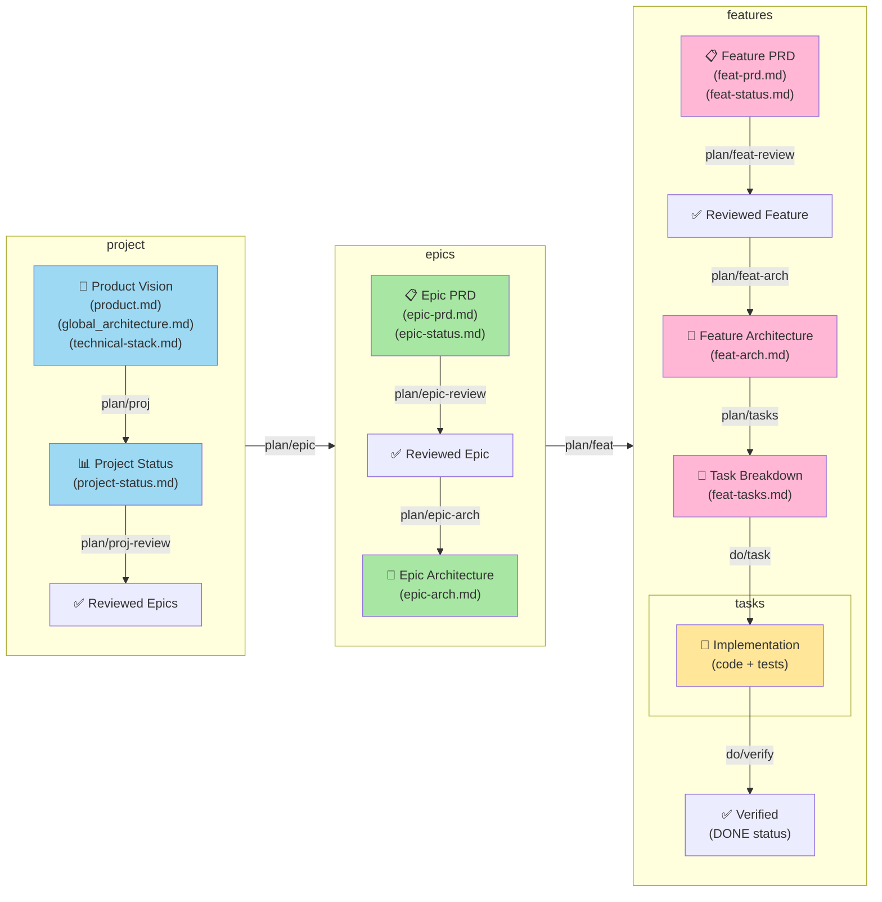

# Plan-Doc-Do-Follow Skill

A comprehensive workflow for product development that guides teams from product vision through documentation, planning, and execution, with built-in business review checkpoints.
Also great for structured vibe coding sessions with clear task breakdown and verification.

## Quick Route Reference

Use the first matching route.

### Planning Phase

| User intent                                            | Route              | Parameters |
| ------------------------------------------------------ | ------------------ | ---------- |
| Plan a project by extracting epics from product vision | `plan/proj`        |            |
| Validate epics with stakeholders                       | `plan/proj-review` |            |
| Create epic PRD and status                             | `plan/epic`        | E{n}       |
| Validate epic specification with stakeholders          | `plan/epic-review` | E{n}       |
| Design technical architecture for an epic              | `plan/epic-arch`   | E{n}       |
| Create feature PRD and status                          | `plan/feat`        | E{n} F{n}  |
| Validate feature specification with stakeholders       | `plan/feat-review` | E{n} F{n}  |
| Design technical architecture for a feature            | `plan/feat-arch`   | E{n} F{n}  |
| Break a feature into implementation tasks              | `plan/tasks`       | E{n} F{n}  |

### Execution Phase

| User intent                              | Route          | Parameters     |
| ---------------------------------------- | -------------- | -------------- |
| Execute an individual task               | `do/task`      | E{n} F{n} T{n} |
| Execute all tasks for a feature          | `do/all-tasks` | E{n} F{n}      |
| Verify completed work meets requirements | `do/verify`    | E{n} F{n}      |
| Memorize good practices                  | `do/memorize`  |                |

## When To Use This Skill

Use this skill when you need to:

- Plan a project by extracting epics from product vision
- Create detailed specifications at epic and feature levels
- Get structured business reviews before proceeding
- Design technical architecture for epics and features
- Break down features into concrete implementation tasks
- Execute work items with clear guidance
- Verify completed work meets requirements
- Track progress from project through execution
- Maintain single source of truth for status at all levels
- Document examples of clean code and good practices for future reference

## Global Invariants (All Routes)

1. **Spirit check**: stay aligned with `docs/product.md` and overall product vision
2. **Business First**: specification reviews before proceeding to next phase
3. **Architecture check**: stay aligned with `docs/global_architecture.md`
4. **Traceability**: keep links between stories, requirements, tasks, tests
5. **No guessing**: if blocking ambiguity exists, ask before generating output
6. **Status integrity**: status must be derived from document reality, not assumptions
7. **Single Source of Truth**: Status tracked in one dedicated file per level
8. **Progressive Detail**: Information becomes more detailed moving from project → task
9. **Clear Routing**: Well-defined routes for each workflow stage
10. **Documentation**: all generated content must be documented in the appropriate files
11. **Traceability**: Each document references parent documents and provides context
12. **Flexibility**: Routes can be used sequentially or independently
13. **Automation**: Progress calculated automatically from task completion
14. **Handoff format**: always end with summary, current progress, exact next command, open questions

Status legend:

- `⚪ TODO` not started
- `🟡 SPEC` specified
- `🟣 PLAN` task plan generated
- `🔵 DEV` implementation in progress
- `🟢 DONE` completed and verified

---

## Route Playbooks

### Plan/Proj - Project Planning

**Purpose**: Extract epics from product vision and architecture

**Input**:

- `docs/product.md` - Product vision and goals
- `docs/global_architecture.md` - System architecture
- `docs/technical-stack.md` - Technology decisions
- Existing `docs/project-status.md` (optional)

**Output**:

- `docs/project-status.md` - Project tracking with epic overview
- `docs/epics/{epic-slug}/epic-brief.md` - One per epic
- `docs/project-review.md` - Business review checklist

**Deliverables**:

- Epic list with clear business intent
- Progress visualization (Mermaid pie chart)
- Dependency graph showing epic relationships
- Review checklist (20-30 items)

**Steps** :

1. Verify both input files exist
2. Distill product spirit in 1-2 sentences
3. Extract stack, patterns, constraints
4. Build epics with codes (`E1...`) and slugs in format `e{n}-{name}` (e.g., `e2-orm-discovery`) and epic briefs with template in `template-epic-brief.md`
5. Map dependencies and place epics into phases
6. Ask questions for scope/priority/stack ambiguity
7. Generate project status using the template in `template-proj-status.md`
8. Generate project review using the template in `template-proj-review.md`
9. Handoff with `@plan/proj-review` as default next command

---

### Plan/Proj-Review - Project Review

**Purpose**: Validate extracted epics with stakeholders

**Input**:

- `docs/project-status.md`
- Epic briefs
- `docs/project-review.md`

**Output**:

- Updated `docs/project-status.md`
- Modified epic briefs based on feedback
- Completed review checklist with sign-off

**Review Validates**:

- Epic scope and sizing
- Business value alignment
- Resource feasibility
- Timeline realism
- Priority sequencing

**Steps**:

1. Verify `docs/project-review.md` exists and read it
2. Update project status with review feedback: adjust epic scopes, priorities, timelines
3. Update epic briefs with any clarifications or changes
4. Mark review checklist items as completed and get stakeholder sign-off
5. Handoff with `@plan/epic E{n}` as default next command

---

### Plan/Epic E{n} - Epic Planning

**Purpose**: Create epic PRD and establish tracking

**Input**:

- Epic brief from plan/proj
- `docs/global_architecture.md`
- `docs/technical-stack.md`
- `docs/project-status.md`

**Output**:

- `docs/epics/{epic-slug}/epic-prd.md` - Epic specification
- `docs/epics/{epic-slug}/epic-status.md` - Tracking (initial: TODO → SPEC after review)
- `docs/epics/{epic-slug}/epic-review.md` - Review checklist

**Specification Includes**:

- Business value and success criteria
- User stories and use cases
- Key features breakdown
- Acceptance criteria
- Dependencies and constraints
- Resource and timeline estimates

**Steps**:

1. Verify `docs/project-status.md` exists and `E{n}` exists
2. If epic already `🟡` or later, warn and confirm re-specify
3. Read `docs/product.md` and `docs/epics/{epic-slug}/epic-brief.md`
4. Define features (`F1...`) with slugs in format `f{n}-{name}` (e.g., `f3-backend-api`) and priorities (`P0/P1/P2`)
6. Ask interactive questions for any ambiguity in requirements, scope or priorities
7. Generate epic PRD using the template in `template-epic-prd.md`
6. Run a subagent which acts as a critical reviewer to review the generated PRD with a critical eye and update the PRD based on the review comments and suggestions
8. Update project status: epic status to `🟡 SPEC`, graph color, changelog
9. Generate epic review using the template in `template-epic-review.md`
10. Consider the checklist review and auto-check the generated content against it, if any item is not met, ask questions to clarify and update the epic PRD until all items are met
11. Add unanswered questions to the review checklist
12. Handoff with `@plan/epic-review E{n}` as default next command


---

### subagent - Critical PRD reviewer

- read `docs/product.md` and `docs/epics/{epic-slug}/epic-brief.md`
- read the PRD `template-epic-prd.md` with a critical view :
  - does the PRD respect the product vision and the global architecture ?
  - what are the most important and differentiating features and what are the unneccessary ones ?
  - is the user journey optimal ? how could it be improved to be more intuitive, comfortable, efficient ?
  - how could the user experience be more comfortable and efficient ?
  - how could we simplify the whole process while focusing on the real added value ?
- formulate the review comments and suggestions to the main agent in a clear and constructive way to help it improve the PRD
---

### Plan/Epic-Review E{n} {prd|arch} - Epic Review

**Purpose**: Validate epic specification with stakeholders

**Input**:

For business and functional review (prd):
- `docs/epics/{epic-slug}/epic-prd.md`
- Epic brief for context
- `docs/epics/{epic-slug}/epic-review.md`
For architecture review (arch):
- `docs/epics/{epic-slug}/epic-prd.md`
- `docs/global_architecture.md` - System context
- `docs/technical-stack.md` - Technology decisions
- `docs/epics/{epic-slug}/epic-arch.md` - Technical design
- `docs/epics/{epic-slug}/epic-review.md`

**Output**:

For business and functional review (prd):
- Updated `docs/epics/{epic-slug}/epic-prd.md` with feedback
- Completed review checklist with business sign-off
- Epic status updated (if business approval)
For architecture review (arch):
- Updated `docs/epics/{epic-slug}/epic-arch.md` with feedback
- Completed review checklist with technical sign-off
- Epic status updated (if technical approval)


**Review Validates**:

For business and functional review (prd):
- Requirements completeness
- Success criteria testability
- User story clarity
- Realistic scope and timeline
- Stakeholder alignment
For architecture review (arch):
- the validity and robustness of the end-to-end data path and flows
- Architectural fit and consistency
- API design and contracts
- Data model appropriateness
- Technology choices
- Performance and scalability considerations
- Security implications
- Deployment and monitoring strategy
- Testing strategy


**Steps**:

1. Verify `docs/epics/{epic-slug}/epic-review.md` exists and read it
2. Auto-check the generated content against the review checklist, if any item is not met, ask questions to clarify and update the epic PRD or architecture until all items are met
3. For functional review, update epic PRD with review feedback: adjust scopes, priorities, timelines
4. For architecture review, update epic architecture document with review feedback: adjust design, APIs, data models, technology choices
5. Update epic status : if approved, keep `🟡 SPEC`; if major changes, revert to `⚪ TODO` and update graph
6. Mark corresponding review checklist items as completed and get stakeholder sign-off (PM for functional review, Tech Lead for architecture review)
7. Handoff with `@plan/epic-arch E{n}` or `@plan/feat E{n} F{1}` as default next command

---

### Plan/Epic-Arch E{n} - Epic Architecture

**Purpose**: Design technical architecture for epic

**Input**:

- `docs/epics/{epic-slug}/epic-prd.md` - Epic specification
- `docs/global_architecture.md` - System context
- `docs/technical-stack.md` - Technology decisions
- Related epic architectures (if applicable)

**Output**:

- `docs/epics/{epic-slug}/epic-arch.md` - Technical design

**Architecture Includes**:

- System components and module breakdown
- Data models and database design
- API specifications and contracts
- Integration points with existing systems
- Technology stack decisions with rationale
- Performance and scalability targets
- Security and compliance approach
- Deployment architecture
- High availability strategy
- Monitoring and observability plan

**Steps**:

1. Verify `docs/project-status.md` exists and `E{n}` exists
2. Read `docs/epics/{epic-slug}/epic-prd.md`, `docs/global_architecture.md` and `docs/technical-stack.md`
3. Document architecture fit, APIs, data model, risks, metrics
4. Ask interactive questions for any ambiguity in architectural decisions or constraints
5. Generate epic architecture document using the template in `template-epic-arch.md`
6. Run a subagent which acts as a critical reviewer to review the generated architecture document with a critical eye and update the architecture document based on the review comments and suggestions
7. Handoff with `@plan/feat E{n} F{n}` as default next command

---

### subagent - Critical ARCH reviewer

- read `docs/epics/{epic-slug}/epic-prd.md`, `docs/global_architecture.md` and `docs/technical-stack.md`
- read the architecture document  `docs/epics/{epic-slug}/epic-arch.md` with a critical view :
  - does the architecture respect the global architecture ?
  - does the architecture respect the technical stack and patterns ?
  - which alternative architectures could we have and what are the pros and cons of each ?
  - are the technology choices relevant and optimal for the problem at hand ?
  - how could we simplify the whole architecture while focusing on the robustness, scalability and maintainability of the solution ?
- formulate the review comments and suggestions to the main agent in a clear and constructive way to help it improve the architecture document

---

### Plan/Feat E{n} F{n} - Feature Planning

**Purpose**: Create feature PRD and establish tracking

**Input**:

- `docs/epics/{epic-slug}/epic-prd.md` - Epic specification
- `docs/epics/{epic-slug}/epic-arch.md` - Epic architecture
- `docs/technical-stack.md` - Technology context

**Output**:

- `docs/epics/{epic-slug}/features/{feat-slug}/feat-prd.md` - Feature specification
- `docs/epics/{epic-slug}/features/{feat-slug}/feat-status.md` - Tracking (initial: TODO)
- `docs/epics/{epic-slug}/features/{feat-slug}/feat-review.md` - Review checklist

**Specification Includes**:

- Feature narrative and user stories
- Use cases and workflows
- Acceptance criteria
- Edge cases and error scenarios
- Performance requirements
- Security requirements
- Accessibility requirements
- Dependencies and blocking items
- Documentation needs

**Steps**:

1. Verify `docs/epics/{epic-slug}/epic-prd.md` exists and `F{n}` exists
2. If feature already `🟡` or later, warn and confirm re-specify
3. Create user stories (`US-{n}`) with Given/When/Then acceptance criteria
4. Create requirements: functional (`FR-{n}` with "shall"), API, UI, data, NFR
5. Define explicit out-of-scope and dependency sections
6. Add test strategy (unit/integration/e2e/edge cases)
7. Ask interactively blocking and important questions with impact labels (blocking/important/minor)
8. Generate feature PRD using the template in `template-feat-prd.md`
9. Generate feature status with initial status `⚪ TODO` using the template in `template-feat-status.md`
10. Generate feature review using the template in `template-feat-review.md`
11. Consider the checklist review and auto-check the generated content against it, if any item is not met, ask questions to clarify and update the feature PRD until all items are met
12. Update epic feature status to `🟡 SPEC` and update epic and project status
13. Handoff with `@plan/feat-review E{n} F{n} PRD` as default next command

---

### Plan/Feat-Review E{n} F{n} {prd|arch}- Feature Review

**Purpose**: Validate feature specification with stakeholders

**Input**:

For business and functional review (prd):
- `docs/epics/{epic-slug}/features/{feat-slug}/feat-prd.md`
- Feature brief for context
- `docs/epics/{epic-slug}/features/{feat-slug}/feat-review.md`
For architecture review (arch):
- `docs/epics/{epic-slug}/features/{feat-slug}/feat-arch.md`

**Output**:

For business and functional review (prd):
- Updated feat-prd.md with feedback
- Completed review checklist with sign-off
- Feature status ready for architecture
For architecture review (arch):
- Updated feat-arch.md with feedback
- Completed architecture review checklist with sign-off
- Feature status ready for task breakdown

**Review Validates**:

For business and functional review (prd):
- Feature scope clarity
- Acceptance criteria testability
- User story completeness
- Integration requirements
- Non-functional requirements
For architecture review (arch):
- Architectural fit and consistency
- API design and contracts
- Data model appropriateness
- Technology choices
- Performance and scalability considerations
- Security implications
- Deployment and monitoring strategy
- Testing strategy

**Steps**:

1. Verify `docs/epics/{epic-slug}/features/{feat-slug}/feat-review.md` exists and read it
2. Auto-check the generated content against the review checklist, if any item is not met, ask questions to clarify and update the feature PRD or architecture until all items are met
3. For functional review, update feature PRD with review feedback: adjust scopes, priorities, timelines
4. For architecture review, update feature architecture document with review feedback: adjust design, APIs, data models, technology choices
5. Update feature status : if review approved, keep `🟡 SPEC`; if major changes, revert to `⚪ TODO` and update graph
6. Mark review checklist items as completed and get stakeholder sign-off (PM for functional review, Tech Lead for architecture review)
7. Handoff with `@plan/feat-arch E{n} F{n}` or `@plan/tasks E{n} F{n}` as default next command

---

### Plan/Feat-Arch E{n} F{n} - Feature Architecture

**Purpose**: Design technical architecture for feature

**Input**:

- `docs/epics/{epic-slug}/features/{feat-slug}/feat-prd.md` - Feature specification
- `docs/epics/{epic-slug}/epic-arch.md` - Epic architecture context
- `docs/technical-stack.md` - Technology decisions

**Output**:

- `docs/epics/{epic-slug}/features/{feat-slug}/feat-arch.md` - Technical design

**Architecture Includes**:

- High-level feature design and components
- Data models and schema
- API and interface design
- Technology decisions with rationale
- Implementation strategy and phases
- Performance considerations
- Security considerations
- Testing strategy
- Deployment considerations
- Error handling and logging approach

**Steps**:

1. Verify `docs/project-status.md` exists and `E{n}` and `F{n}` exist
2. Read `docs/epics/{epic-slug}/features/{feat-slug}/feat-prd.md`, `docs/epics/{epic-slug}/epic-arch.md` and `docs/technical-stack.md`
3. Document architecture fit, APIs, data model, risks, metrics
4. Ask interactive questions for any ambiguity in architectural decisions or constraints
5. Run architecture check and keep a critical eye on the design to ensure it is as simple as possible while robust, scalable and maintainable
6. Generate feature architecture document using the template in `template-feat-arch.md`
7. Handoff with `@plan/feat-review E{n} F{n} arch` or `@plan/tasks E{n} F{n}` as default next command

---

### Plan/Tasks E{n} F{n} - Task Breakdown

**Purpose**: Break feature into concrete implementation tasks

**Input**:

- `docs/epics/{epic-slug}/features/{feat-slug}/feat-prd.md` - Feature specification
- `docs/epics/{epic-slug}/features/{feat-slug}/feat-arch.md` - Feature architecture
- Team information: size, skills, velocity

**Output**:

- `docs/epics/{epic-slug}/features/{feat-slug}/feat-tasks.md` - Task breakdown
- Updated `docs/epics/{epic-slug}/features/{feat-slug}/feat-status.md` → PLAN

**Task Breakdown Includes**:

- Individual task descriptions with clear acceptance criteria
- Effort estimation (story points)
- Task dependencies and sequencing
- Critical path identification
- Parallelizable tasks
- Risk assessment
- Success metrics
- Task size: 30-60 minutes.
- Task scope: one concern.
- Task completeness: can be executed without external context.
- Each task must include WHAT/WHERE/HOW/WHY/DONE.

**Steps**:

1. Verify feature status is `🟡 SPEC`
2. Verify both `docs/epics/{epic-slug}/features/{feat-slug}/feat-prd.md` and `docs/epics/{epic-slug}/features/{feat-slug}/feat-arch.md` exist and read them
3. Extract PRD requirements and acceptance criteria
4. Build dependency DAG in this order: data -> business -> API -> UI, tests interleaved
5. For each task, include exact files, steps, real code pattern reference and validation commands from `docs/patterns/`
6. Update feature status to `🟣 PLAN`; if all epic features are planned, set epic `🟣 PLAN`.
7. Handoff with `@do/task E{n} F{n} T1` (first unblocked task)

---

### Do/Task {feat-tasks.md} E{n} F{n} T{n} - Task Execution

**Purpose**: Execute an individual task

**Input**:

- Task description from `feat-tasks.md`
- Feature specification and architecture
- Epic context and acceptance criteria
- Code standards from `.github/instructions/`
- Project best practices from `docs/technical-stack.md` and `.github/copilot-instructions.md`

**Output**:

- Implemented code in feature branch
- Automated tests (unit + integration)
- Technical documentation if needed
- Updated `feat-status.md` → DEV

**Execution Includes**:

- Step-by-step implementation guidance
- Code quality adherence
- Test coverage validation (≥80%)
- Performance considerations
- Security best practices

**Steps**:

1. Read full task and its dependencies in `feat-tasks.md`
2. Read referenced code pattern and target files
3. Implement minimally and precisely
4. Run validation and fix until pass or report blocker
5. Update `feat-tasks.md`: table + task section + graph color for `T{n}` to `🟢 DONE`
6. If all tasks done, set feature status to `🔵 DEV` in `feat-status.md`;
7. if all features in epic done, set epic status to `🔵 DEV` in `epic-status.md`
8. Handoff with `@do/task E{n} F{n} T{n}` (first unblocked task) or `@do/verify E{n} F{n}` if all tasks done

---

### Do/AllTasks {feat-tasks.md} E{n} F{n} - Task Execution for whole feature

**Purpose**: Execute all tasks with subagents for individual tasks

**Input**:

- Task description from `feat-tasks.md`
- Feature specification and architecture
- Epic context and acceptance criteria
- Code standards from `.github/instructions/`
- Project best practices from `docs/technical-stack.md` and `.github/copilot-instructions.md`

**Output**:

- Implemented code in feature branch
- Automated tests (unit + integration)
- Technical documentation if needed
- Updated `feat-status.md` → DEV

**Execution Includes**:

- Step-by-step implementation guidance
- Code quality adherence
- Test coverage validation (≥80%)
- Performance considerations
- Security best practices

**Steps**:

1. Read full task and its dependencies in `feat-tasks.md`
2. Read referenced code pattern and target files
3. Identify independent tasks that can be executed in parallel and run subagents for each with clear instructions and blockers
4. Once a wave of tasks is done, run the linter and fix any issue
5. Once a wave of tasks is done, ask the user if they want to continue
6. For dependent tasks, like final tests, execute sequentially with the same process
7. If all tasks done, set feature status to `🔵 DEV` in `feat-status.md`;
8. if all features in epic done, set epic status to `🔵 DEV` in `epic-status.md`
9. Handoff with `@do/verify E{n} F{n}`

---

### Do/Verify {feat-tasks.md} E{n} F{n} - Feature completion verification

**Purpose**: Verify completed work meets requirements for current feature

**Input**:

- Task acceptance criteria
- Feature specification
- Implemented code and tests
- Documentation

**Output**:

- Verification summary
- Status update (✓ DONE or ✗ with gaps)
- Code review feedback if needed
- Progress updates: feat-status.md → DONE, project-status.md → updated

**Verification Checks**:

- ✓ All acceptance criteria met
- ✓ Code passes linting/formatting
- ✓ Tests pass (unit + integration)
- ✓ Test coverage ≥ 80%
- ✓ Documentation complete
- ✓ Performance targets met
- ✓ Security requirements met
- ✓ No breaking changes

**Steps**:

1. Read feature specification and acceptance criteria in `feat-prd.md`
2. Review implemented code and tests
3. Run linters and formatters and fix any issue
4. Run all tests and check coverage
5. Check documentation completeness
6. Assess performance and security if applicable
7. If all checks pass, update `feat-status.md` to 🟢 DONE
8. If any checks fail, provide detailed feedback and update `feat-status.md` with blockers
9. If all features in epic are done, set epic status to 🟢 DONE in `epic-status.md` and `project-status.md`
10. I feature is done, set feature status to 🟢 DONE in `project-status.md` and update this document (pie-chart, blockers...)
11. Handoff with next command: `@plan/feat E{n} F{n+1}` or `@plan/epic E{n+1}` if all features done

### Do/Memorize - document good practices and patterns for future reference

**Purpose**: Document good practices and patterns for future reference

**Input**:

- Existing code patterns and practices from current implementation (to initialize an existing project)
- New good practice or pattern observed during execution
- Fixes for common blockers or issues
- Examples of clean code or effective solutions
- Lessons learned from the current work
- Project specific usage to run tests, launch commands, install dependencies, etc.

**Output**:

- Documented good practices in `docs/patterns` folder
- Updated `.github/copilot-instructions.md` with references to new patterns

**Verification Checks**:

- ✓ Clear description of the practice or pattern
- ✓ Context of when to use it
- ✓ Examples of implementation
- ✓ Benefits and trade-offs
- ✓ Link to related documentation or code standards

**Steps**:

1. Read existing patterns in `docs/patterns` and `.github/copilot-instructions.md`
2. Check if the new practice or pattern is already documented
3. If it is, consider if it needs updating with new insights or examples and update accordingly
4. If not, create a new markdown file in `docs/patterns` with a clear structure: description, context, examples, benefits
5. Update `.github/copilot-instructions.md` to reference the new pattern and provide guidance on when to use it
6. Handoff with next command based on current workflow stage (e.g., `@do/task` for implementation, `@plan/feat` for planning)


---

## File Organization

```
docs/
├── product.md (input: product vision)
├── global_architecture.md (input: architecture overview)
├── technical-stack.md (input: technology decisions)
├── project-status.md (output: project tracking)
├── project-review.md (output from plan/proj-review)
└── patterns/
|   └── {pattern-name}.md (output from do/memorize)
└── epics/
    └── e{n}-{epic-name}/  # Epic slug format: e{n}-{name}, e.g., e2-orm-discovery
        ├── epic-brief.md (output from plan/proj)
        ├── epic-prd.md (output from plan/epic)
        ├── epic-status.md (output from plan/epic, updated throughout)
        ├── epic-arch.md (output from plan/epic-arch)
        ├── epic-review.md (output from plan/epic-review)
        └── features/
            └── f{n}-{feat-name}/  # Feature slug format: f{n}-{name}, e.g., f3-backend-api
                ├── feat-prd.md (output from plan/feat)
                ├── feat-status.md (output from plan/feat, updated throughout)
                ├── feat-arch.md (output from plan/feat-arch)
                ├── feat-tasks.md (output from plan/tasks)
                └── feat-review.md (output from plan/feat-review)
```

---

## Progress Calculation

```
Feature progress = completed tasks / total tasks
Epic progress = sum(completed tasks in all features) / sum(total tasks in all features)
Project progress = sum(completed tasks in all epics) / sum(total tasks in all epics)

If total tasks = 0: progress = 0
```

## Workflow Summary



## Templates Available

Reference templates in this skill directory:

**Project Level**:
- `template-proj-status.md` - Project status and epic roadmap
- `template-proj-review.md` - Project review checklist

**Epic Level**:
- `template-epic-brief.md` - Epic brief summary
- `template-epic-prd.md` - Epic PRD structure
- `template-epic-status.md` - Epic status tracking
- `template-epic-review.md` - Epic review checklist
- `template-epic-arch.md` - Epic architecture design

**Feature Level**:
- `template-feat-prd.md` - Feature PRD structure
- `template-feat-status.md` - Feature status tracking
- `template-feat-review.md` - Feature review checklist
- `template-feat-arch.md` - Feature architecture design
- `template-feat-tasks.md` - Task breakdown

## Integration Points

This skill assumes:

- Repository structure with `docs/` folder
- `docs/product.md` for product vision
- `docs/global_architecture.md` for architecture overview
- `docs/technical-stack.md` for technology decisions
- `.github/instructions/` for coding and testing standards
- `.github/copilot-instructions.md` for repository conventions
- `docs/patterns/` for documented good practices and patterns

## Related Resources

- Technical Stack: `docs/technical-stack.md`
- Coding Standards: `.github/instructions/`
- Repository Instructions: `.github/copilot-instructions.md`
- Architecture Documentation: `docs/global_architecture.md`
- Patterns and Practices: `docs/patterns/`
