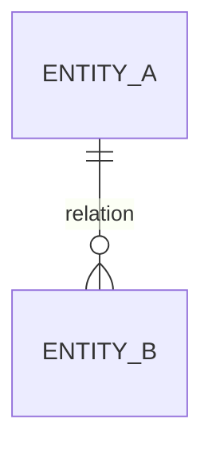

# Data Model

> **Last Updated**: {date}

<!-- LIVING DOC — the single global truth for the project's data schema.
     Epic/feature architecture documents describe deltas and link here; they never fork it.
     Any change that touches schema or migrations MUST update this file in the same change
     (do/verify enforces this). If the project already maintains schema docs elsewhere,
     this file becomes a pointer to them plus the change log. -->

## Entity Overview

## Entities

### {entity_name}

| Field | Type | Constraints | Description |
| ----- | ---- | ----------- | ----------- |
| id    | {type} | PK        | {…}         |

Relations: {…}
Introduced by: E{n} {— revised by E{m} F{k}, if applicable}

## Conventions

- {naming, id strategy, timestamps, soft-delete policy, …}

## Change Log

- {date} — E{n} F{n}: {what changed, one sentence}
