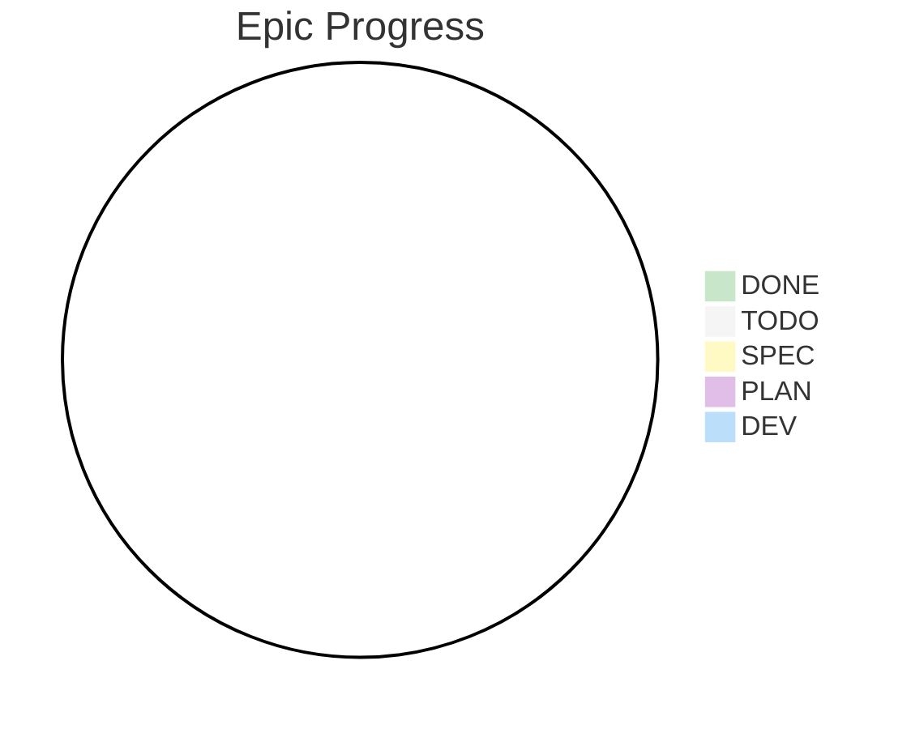

# Epic Status Tracking

> **Code**: E{n}
>
> **Slug**: e{n}-{epic-name} (e.g., e2-orm-discovery)
>
> **Last Updated**: YYYY-MM-DD
>
> **Current Status**: ⚪ TODO (not started)

## Status Definitions

- ⚪ **TODO**: not started
- 🟡 **SPEC**: business spec reviewed
- 🟣 **PLAN**: tasks generated
- 🔵 **DEV**: implementation in progress
- 🟢 **DONE**: verified

## Progress Calculation

Epic progress = sum(completed features) / sum(features)

## Progress Overview: 0% (0/0 features with tasks)

## Feature Breakdown

| Feature        | Status | Progress | Owner |
| -------------- | ------ | -------- | ----- |
| [feature-name] | ⚪ TODO | 0%       | -     |

## Dependencies

{mermaid flow chart}

### Blocks

- [Epic/Feature X]: [description]

### Depends On

- [Epic/Feature Y]: [description]

### Related

- [Epic/Feature Z]: [description]

## Timeline

- **Started**: [date]
- **Target Completion**: [date]
- **Current Phase**: [phase name]

## Key Blockers

- [ ] Blocker 1 (if any)

## Notes

[Any additional context]
