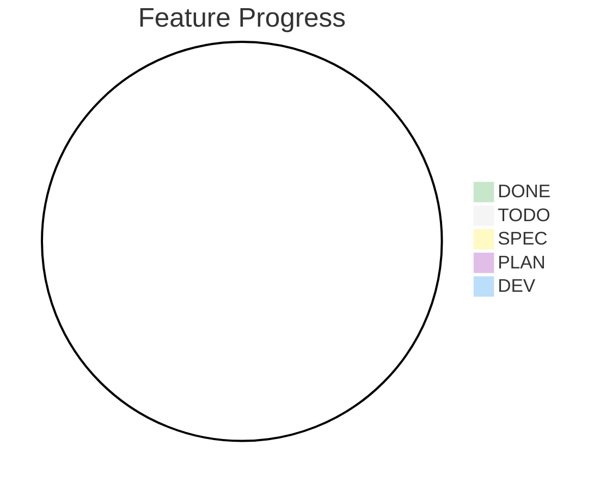

# Feature Status Tracking

> **Feature**: {feature-name} (F{n})
>
> **Epic**: {epic-name} (E{n})
>
> **Last Updated**: YYYY-MM-DD
>
> **Current Status**: ⚪ TODO (not started)

## Status Definitions

- ⚪ **TODO**: not started
- 🟡 **SPEC**: business spec reviewed
- 🟣 **PLAN**: tasks generated
- 🔵 **DEV**: implementation in progress
- 🟢 **DONE**: verified

## Progress Calculation

Feature progress = completed tasks / total tasks

## Progress Overview: 0% (0/0 tasks complete)

## Task Breakdown

| Task ID | Task Name   | Status | Owner | Progress |
| ------- | ----------- | ------ | ----- | -------- |
| TASK-1  | [task name] | ⚪ TODO | -     | -        |

## Dependencies

{mermaid flow chart}

### Blocks

- [Feature X]: [description]
- [Epic Y]: [description]

### Depends On

- [Feature X]: [description]
- [Task Y]: [description]

### Related

- [Feature X]: [description]

## Timeline

- **Started**: [date]
- **Target Completion**: [date]
- **Current Phase**: [phase name]

## Key Blockers

- [ ] Blocker 1 (if any)

## Velocity & Estimates

- **Total Story Points**: [number]
- **Completed Story Points**: [number]
- **Remaining Story Points**: [number]
- **Team Velocity**: [points/sprint]

## Notes

[Any additional context or recent updates]
