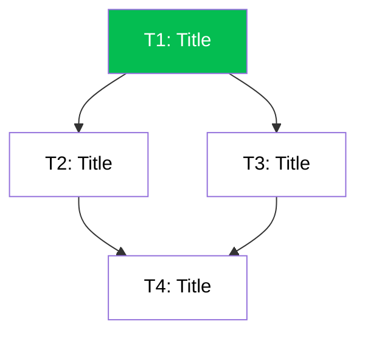

# Task Breakdown & Implementation Plan

> **Feature**: {feature-name} (F{n})
>
> **Epic**: {epic-name} (E{n})
>
> **Total Effort**: X story points
>
> **Timeline**: Y weeks
>
> **Team Size**: Z developers

## Task Dependencies

## Task List

### Summary

| Code | Task | Type | Est. | Dependencies | Status |
|------|------|------|------|-------------|--------|

### Task 1: [Title] (X story points)

- **Type:** Database / Backend / API / Frontend / Test / Config
- **Effort**: X story points | **Duration**: Y days | **Assigned**: [optional]
- **Status**: ⚪ TODO
- **Depends on**: None (can start immediately)

**Objective:** {single sentence}
**Context:** {2-3 sentences}

**Files:**
- Create: `...`
- Modify: `...`

**Steps:**
1. ...
2. ...

**Acceptance Criteria**:
- [ ] Criterion 1
- [ ] Criterion 2
- [ ] Criterion 3

**Technical Requirements**:
[Specific implementation details, tech stack, code patterns]
- Follow `path/to/file` (relevant lines)

**Testing Requirements**:
- [ ] Unit tests (coverage ≥ 80%)
- [ ] Integration tests
- [ ] Manual testing steps: [list]

**Blocking/Notes**:
[Any known issues, dependencies, or considerations]

---

### Task 2: [Title] (X story points)

- **Type:** Database / Backend / API / Frontend / Test / Config
- **Effort**: X story points | **Duration**: Y days
- **Status**: ⚪ TODO
- **Depends on**: Task 1

[Similar structure]

---

### Task 3: [Title] (X story points)

[Similar structure]

---

## Effort Estimation Reference

- **1-3 points**: Few hours, straightforward
- **3-5 points**: 1-2 days, some complexity
- **5-8 points**: 2-3 days, moderate complexity
- **8+ points**: Too large, should break down further

## Critical Path

[Tasks on the critical path that must be completed before others can start]
1. Task 1 → Task 2 → Task 4

## Parallelizable Tasks

[Tasks that can be worked on simultaneously]
- Task 2 and Task 3 can be done in parallel (independent modules)

## Risk Assessment

| Risk | Probability | Impact | Mitigation |
|------|-------------|--------|-----------|
| [Risk 1] | [High/Med/Low] | [High/Med/Low] | [mitigation strategy] |

## Success Metrics

- All acceptance criteria met
- Test coverage ≥ 80%
- Performance targets met
- Code review approval
