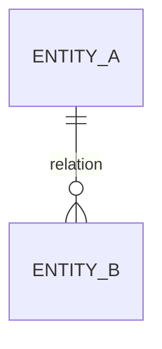

# Data Model

> **Last Updated**: {date}

<!-- LIVING DOC — single global truth for data schema. Arch docs describe deltas and
     link here, never fork it. Any schema/migration change updates this file in same
     change (do/verify enforces). If schema docs exist elsewhere, this file = pointer
     to them plus change log -->

## Entity Overview

## Entities

### {entity_name}

| Field | Type | Constraints | Description |
| ----- | ---- | ----------- | ----------- |
| id    | {type} | PK        | {…}         |

Relations: {…}
Introduced by: E{n} {— revised by E{m} F{k}, if applicable}

## Conventions

- {naming, id strategy, timestamps, soft-delete policy, …}

## Change Log

- {date} — E{n} F{n}: {what changed, one sentence}
