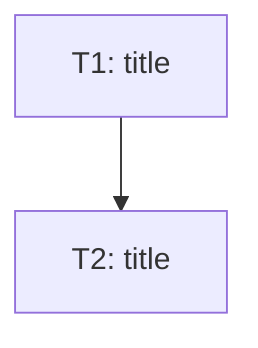

# Task Breakdown — {feature-name}

> **Feature**: F{n} — {feature-name}
>
> **Epic**: E{n} — {epic-name}
>
> **Last Updated**: {date}

<!-- Delete unused sections. Never write "N/A"
     Solo mode: omit Effort column -->

## Task Summary

<!-- OWNING TABLE: SINGLE source of truth for task status
     Per-task sections below carry NO status — update only this table -->

| Code | Task    | Type                                        | Depends on | Status |
| ---- | ------- | ------------------------------------------- | ---------- | ------ |
| T1   | {title} | Database/Backend/API/Frontend/Test/Config   | —          | ⚪     |
| T2   | {title} | {type}                                      | T1         | ⚪     |

**Parallelizable**: {e.g. T2 and T3 independent}
**Critical path**: {e.g. T1 → T2 → T4}

## Dependency Graph (optional, decorative)

<!-- Regenerated from Task Summary table; never source of truth -->

---

## Task Details

<!-- Every task executable by weaker model WITHOUT opening PRD or any other doc:
     WHAT / WHERE / HOW / WHY / DONE all explicit -->

### T1: {title}

**Objective (WHAT/WHY)**: {one sentence: what built and why}
**Context**: {2–3 sentences: everything needed to work standalone}

**Files (WHERE)**:
- Create: `exact/path/to/file`
- Modify: `exact/path/to/file`

**Steps (HOW)**:
1. {concrete step}
2. {concrete step}

**Pattern reference**: `docs/patterns/{pattern}.md` (if applies)

**Done when (DONE)**:
- [ ] {verifiable criterion}
- [ ] Tests: {what to test and how}
- [ ] Validation command(s): `{runnable command}`

**Notes**: {known pitfalls — delete if none}

---

### T2: {title}

{same structure}

---

## Blockers

- [ ] {blocker as complete sentence — delete section if none}

## Risks (optional)

| Risk | Likelihood | Impact | Mitigation |
| ---- | ---------- | ------ | ---------- |
