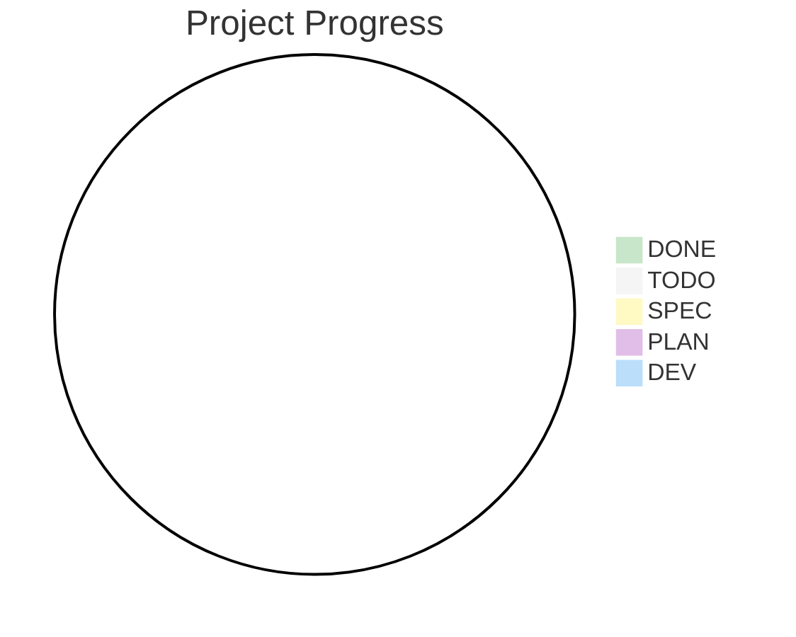

# Project Status

> **Project**: {project-name}
>
> **Mode**: solo | team
>
> **Status**: {⚪|🟡|🟣|🔵|🟢}
>
> **Last Updated**: {date}

<!-- Delete unused sections. Never write "N/A" -->

## Product Spirit

{5–10 complete sentences: what the product is, who it is for, what makes it different, and what it deliberately is NOT. This block is reused verbatim by every planning route and reviewer — keep it sharp and stable.}

## Epic Roadmap

<!-- OWNING TABLE: single source of truth for epic status and progress -->

| Code | Epic        | Status | Priority | Progress (tasks) | Features |
| ---- | ----------- | ------ | -------- | ---------------- | -------- |
| E1   | {epic-name} | ⚪     | P0       | 0/0              | {n}      |

## Progress

Tasks done: {n}/{total} ({percentage}%)

## Dependencies

{Mermaid flowchart of epic dependencies, colored by status — regenerated by Status Sync, never hand-edited}

## Risks & Issues

| Risk   | Impact       | Mitigation   |
| ------ | ------------ | ------------ |
| {risk} | High/Med/Low | {mitigation} |

## Milestones (optional)

- {milestone}: {date}

## Changelog

<!-- HARD RULE — milestones only: epic completed, major scope change, migration
     Newest first, one line per entry, ≤25 words. Never: tasks generated, PRD
     drafted/approved, feature-level events, critic findings, "Next:" commands
     Whole project needs only few lines here — everything else lives in git and
     owning tables. If existing entries below violate this, they are legacy —
     do NOT match them -->

- {date}: E{n} {epic-name} completed 🟢

## Next Steps

- {exact next command, e.g. `@plan/epic E1`}
